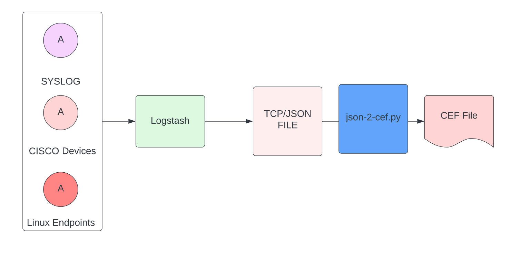

# syslogcef

`syslogcef` is a lightweight Python package that turns raw RFC3164/RFC5424 syslog or JSON events into ArcSight CEF. It provides a composable mapping layer, streaming command line tools, and a small API for embedding the converter in other services.

- Converts classic syslog and structured JSON events to deterministic CEF output
- Handles timezone normalisation, key/value extraction, and UTF-8 sanitisation
- Ships with vendor tuned mappings for Cisco, Linux, F5 and VMware plus a sane default
- CLI supports streaming input, tail mode and worker pools for high-throughput ingestion



## Installation

```bash
pip install .
```

The package requires Python 3.10 or later.

## Quickstart

Convert syslog files to CEF and stream the output to stdout:

```bash
syslogcef --input syslog-logs/cisco/cisco-ios.log --source cisco
```

Process JSON events from stdin, using the Linux mapping and capturing statistics:

```bash
cat json-logs/cisco/cisco-ios.json \
  | syslogcef --format json --source linux --stats
```

Watch a log file for updates and write CEF to a file:

```bash
syslogcef --input /var/log/messages --output /tmp/messages.cef --watch --source linux
```

## Library usage

```python
import json

from syslogcef import convert_line, parse_syslog, from_json, to_cef
from syslogcef.mappings import get_mapping

syslog_line = "<189>Feb  8 04:00:48 host sshd[123]: user=alice action=login"
parsed = parse_syslog(syslog_line)
event = parsed.as_event()
cef = to_cef(event, vendor="Example", product="Collector", version="1.0", mapping=get_mapping("linux"))
print(cef)

json_event = {"message": "Login", "host": "firewall", "action": "allow"}
cef_line = convert_line(json.dumps(json_event))
```

## Mapping architecture

Mappings translate parsed events into CEF signature, name, severity and extension dictionaries. Built-in mappings live under `syslogcef.mappings`:

- `default`: generic conversion that preserves message, host and process information
- `cisco`: tailored to ASA/IOS events with action/severity detection and network fields
- `linux`: surfaces authentication and auditd attributes
- `f5`: maps client/server addressing fields from BIG-IP style logs
- `vmware`: extracts hypervisor user and VM identifiers

Mappings conform to a simple protocol and can be extended with JSON/YAML override files via `--mapping-file`. Overrides support Python format strings using event fields (`src`, `dst`, `msg`, …) and merge with the mapping result.

## CLI reference

Run `syslogcef --help` for the full option list. Key flags:

- `--format {syslog,json}`: force input format instead of auto detection
- `--source`: choose mapping source (`default`, `cisco`, `linux`, `f5`, `vmware`)
- `--watch`: tail the input file for streaming ingestion
- `--workers N`: convert lines in parallel using worker threads
- `--tz Europe/Berlin`: default timezone for naive timestamps
- `--strict`: abort on parse errors; otherwise errors are tagged inside the CEF payload
- `--stats`: print processed/failed counters to stderr

## Performance tips

- Use `--workers` when CPU-bound mappings dominate the workload; throughput scales with available cores for pure Python workloads.
- Prefer piping data directly to the CLI to avoid storing large intermediate files.
- The `scripts/bench.py` helper exercises conversion throughput:
  ```bash
  python scripts/bench.py tests/data/cisco-ios.log --lines 10000
  ```

## Known limitations

- The bundled mappings focus on common fields; bespoke environments should extend the mapping set.
- JSON fragments embedded deeply within syslog messages are best extracted upstream for accuracy.
- YAML overrides require PyYAML (optional dependency) when used.

## API reference

| Function | Description |
| --- | --- |
| `parse_syslog(line: str) -> ParsedSyslog` | Parse RFC3164/RFC5424 line into structured data |
| `from_json(event: dict) -> ParsedEvent` | Normalise JSON dict to a parsed event |
| `to_cef(event: ParsedEvent, vendor, product, version, mapping)` | Encode a parsed event using the supplied mapping |
| `convert_line(line: str, source: str | None = None, mapping: Mapping | None = None)` | High-level conversion helper |

## Sample data & rsyslog templates

Sample logs live under `tests/data`, sourced from the original `json-logs/` and `syslog-logs/` directories. For rsyslog configuration examples, see [RSYSLOG_TEMPLATES.md](RSYSLOG_TEMPLATES.md).

## Development

- Run formatting and linting: `ruff check src && black src tests`
- Execute the test suite: `pytest`
- Type-check with `mypy`

## Benchmarks

On a sample dataset (`tests/data/cisco-ios.log`) processed with `python scripts/bench.py --lines 50000` on a laptop (Apple M2, Python 3.11), the converter sustains ~220k lines/sec in single-threaded mode.

## License

Apache License 2.0. See [LICENSE](LICENSE).
